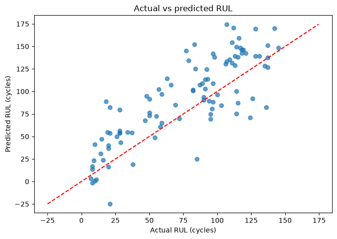

# Turbofan Remaining Useful Life Prediction

[](https://github.com/PrashantSinghpns/turbofan-rul-prediction/actions/workflows/checks.yml)

Predict **Remaining Useful Life (RUL)** in operating cycles from turbofan sensor readings using NASA C-MAPSS FD001. This project compares classical regression models, separates engine trajectories during validation, and exports a complete preprocessing/model pipeline for repeatable inference.

## Problem and objective

An engine's sensor readings change as it degrades. The objective is to estimate how many operating cycles remain before failure using its current cycle, operating settings and sensor measurements.

This is a regression task. MAE and RMSE are measured in **cycles**; R² is a fit statistic, not a classification accuracy percentage.

## Dataset

Source: [NASA Prognostics Center of Excellence — Turbofan Engine Degradation Simulation](https://www.nasa.gov/intelligent-systems-division/discovery-and-systems-health/pcoe/pcoe-data-set-repository/).

This notebook evaluates **FD001 only**. The NASA dataset describes this subset as one operating condition and one fault mode, high-pressure-compressor degradation. Other C-MAPSS subsets are outside this project's reported results.

| Item | This run |
|---|---:|
| Training trajectories | 100 engines |
| Training records | 20,631 rows |
| Validation split | 80 training engines / 20 validation engines |
| Official test trajectories | 100 engines |
| Source schema | Engine ID, cycle, 3 operating settings, 21 sensors |
| Candidate predictors | 25; engine ID is excluded |

Training trajectories run to failure. Their labels are `RUL = final training cycle - current cycle`, without a cap. Official test trajectories stop before failure; their final observed rows are evaluated against `RUL_FD001.txt` in engine-number order. Test RUL is **not** calculated from the last observed test cycle.

The full source dataset is not bundled. [Data setup](data/README.md) explains the three files needed to reproduce the experiment. Three endpoint feature rows are included only as an inference example, with their expected predictions in `examples/expected_predictions.csv`.

## ML workflow

1. Load and name the 26 source columns; inspect missing values and duplicate engine/cycle records.
2. Explore engine lifetimes and an example sensor trajectory.
3. Create training RUL labels and exclude the engine identifier from predictors.
4. Split with `GroupShuffleSplit(test_size=0.2, random_state=42)` so no engine occurs in both partitions.
5. Fit constant-column removal inside each model pipeline; apply `StandardScaler` to linear models only.
6. Compare Linear Regression, Ridge and Random Forest on validation RMSE.
7. Tune Ridge's alpha with five-fold `GroupKFold` on training engines. Filtering and scaling are refitted within each fold.
8. Compare tuned Ridge with the baselines, freeze the selected candidate, then refit on all FD001 training data.
9. Evaluate one final observed record per official test engine; inspect large errors and export the matching artifacts.

The validation set is used for model selection. The official test data was already explored during development, so these results are a reproducible public benchmark, not new independent external validation.

## Models and measured results

Models tested: **Linear Regression**, **Ridge Regression**, and **Random Forest Regressor** with 100 trees. Ridge tuning tested alpha values `0.001, 0.01, 0.1, 1, 10, 100`; grouped CV selected **100** for that candidate.

**Linear Regression** achieved the lowest validation RMSE among the compared candidates and was selected for the final refit. The complete validation table is in [results/validation_model_comparison.csv](results/validation_model_comparison.csv).

| Official FD001 endpoint metric | Value |
|---|---:|
| MAE | 25.975 cycles |
| RMSE | 31.250 cycles |
| R² | 0.434 |

These values were reproduced by running the cleaned notebook end to end on 7 October 2026. Unrounded values, engine-level predictions and data fingerprints are included under `results/`.



Positive prediction error means overestimating remaining life, potentially delaying maintenance. Predictions are evaluated without clipping. Validation scores pool all observed cycle rows, whereas official test scores use only engine endpoints; the two scores should not be treated as the same evaluation population.

## Repository structure

```text
turbofan-rul-prediction/
├── README.md
├── requirements.txt
├── requirements-dev.txt
├── predict.py
├── notebooks/
│   └── 01_data_understanding.ipynb
├── data/
│   └── README.md
├── results/
│   ├── final_model_pipeline.joblib
│   ├── final_metrics.csv
│   ├── fd001_test_predictions.csv
│   ├── validation_model_comparison.csv
│   └── run_metadata.json
├── examples/
│   ├── input_features.csv
│   └── expected_predictions.csv
├── assets/
│   └── actual_vs_predicted.png
├── tests/
│   └── test_project.py
└── .github/workflows/checks.yml
```

## Run the project

The included model was generated using **Python 3.14.6** and the versions pinned in `requirements.txt`. Use Python 3.14 with those dependencies to load it. The model is stored as a single fitted pipeline, so filtering and scaling are applied consistently at prediction time.

From Windows PowerShell:

```powershell
git clone https://github.com/PrashantSinghpns/turbofan-rul-prediction.git  # Download the project.
cd turbofan-rul-prediction  # Enter its root folder.
python -m venv .venv  # Create an isolated environment.
.\.venv\Scripts\python -m pip install -r requirements.txt  # Install the inference dependencies.
.\.venv\Scripts\python predict.py --input examples/input_features.csv --output results/example_predictions.csv  # Run the included example.
```

On Linux/macOS, use `.venv/bin/python` instead of `.venv\Scripts\python`.

The input CSV must contain the 25 candidate feature columns shown in `examples/input_features.csv`. Extra columns such as `unit_number` are preserved in the output but excluded from model inputs. The CLI rejects missing features and non-finite values. Only load trusted joblib artifacts.

### Reproduce training and evaluation

1. Obtain the NASA data and place the three FD001 files as described in `data/README.md`.
2. Install the notebook dependencies and start Jupyter from the repository root:

```powershell
.\.venv\Scripts\python -m pip install -r requirements-dev.txt  # Install Jupyter and plotting tools.
.\.venv\Scripts\python -m jupyterlab  # Open the notebook interface.
```

Open `notebooks/01_data_understanding.ipynb` and run all cells. It contains 13 concise steps with only important comments. To export a new run, set `SAVE_RESULTS = True` in the final code cell; exports go to `results/cleaned_fd001_run/`. The included benchmark bundle remains intact.

### Checks

```powershell
.\.venv\Scripts\python -m unittest discover -s tests -v  # Check artifact inference, metrics and notebook syntax.
```

GitHub Actions runs these dataset-free checks on Linux with Python 3.14. It does not rerun model training or establish real-engine performance.

## Limitations and next work

- This is a classical baseline with R² of approximately 0.434; substantial prediction error remains.
- Results cover FD001 and one engine-wise validation split. Longer validation trajectories contribute more rows to pooled metrics.
- Cycle-wise inputs do not explicitly model temporal windows. Sequence models, richer features, RUL caps and different split policies would change the experiment and require a fresh evaluation protocol.
- No field deployment, uncertainty calibration or safety-critical maintenance validation is claimed.

## Dataset citation

A. Saxena and K. Goebel (2008), *Turbofan Engine Degradation Simulation Data Set*, NASA Prognostics Data Repository, NASA Ames Research Center, Moffett Field, CA.

Project author: **Prashant Singh**.
